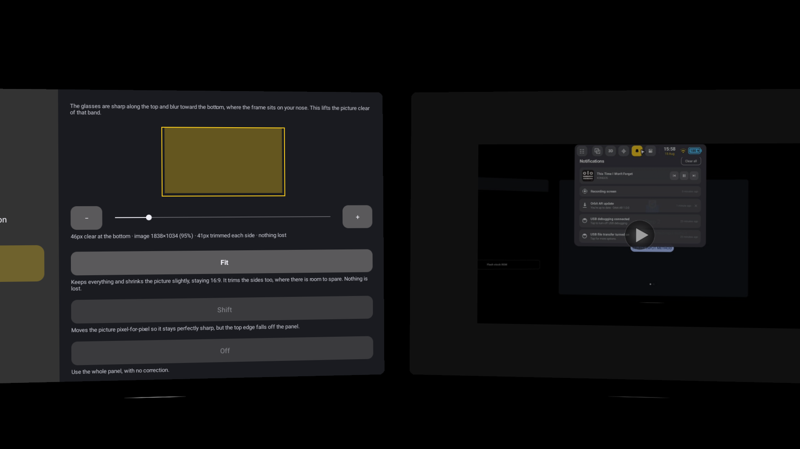
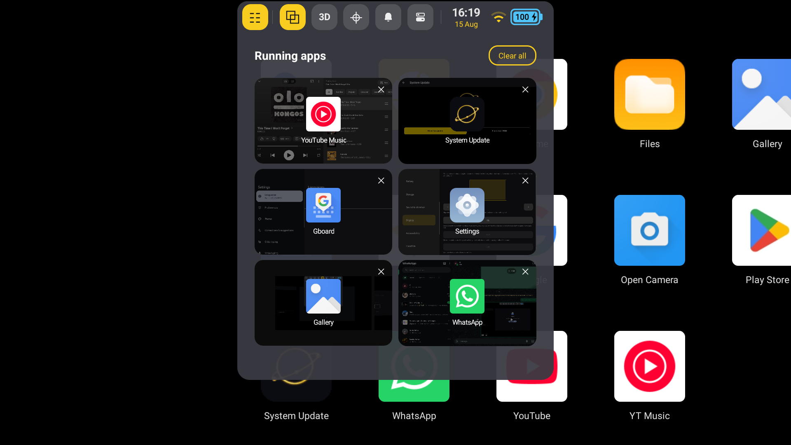
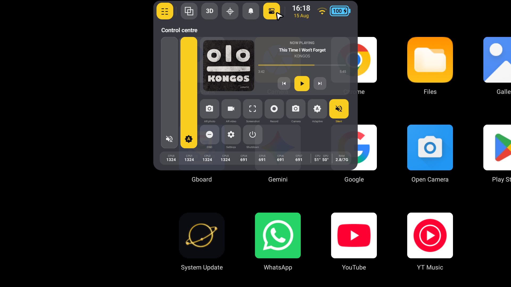

<div align="center">

<p align="center">
  <span style="display: inline-block; vertical-align: middle; width: 48%; text-align: left;">
    <a href="https://discord.gg/CSDJRmvc6">
      
    </a>
  </span>
  <span style="display: inline-block; vertical-align: middle; width: 48%; text-align: right;">
    <a href="https://ko-fi.com/M4M61OKJDA">
      
    </a>
    <br>
    <small>If you would like to support further development: <a href="https://ko-fi.com/j4ckgrey"><strong>Support on Ko-fi</strong></a></small>
  </span>
</p>

[Install](#installing) • [Features](#what-it-does) • [The bars](#the-two-bars) • [Controls](#controls) • [Discord](https://discord.gg/4yB8URK9s)

<p align="center">
  
</p>

---

</div>

> **Personal use**
> This build and its modifications are for personal use. Anyone who installs, runs or modifies it
> does so at their own risk and on their own responsibility.

---

## What Orbit is

Orbit replaces the launcher on the INMO Air3 with a spatial shell. Apps open as windows placed
around you in the room, and your head aims the cursor. Everything else about the glasses stays as it
was — the same apps, the same Play Store, the same keyboard.

It comes as a system update. Install it and the glasses start in Orbit.

---

## What it does

### Apps as windows

Each app runs on its own private display and is composited into a scene you look around. Open
several, put them where you want them, and they stay there while you turn your head. A window can be
moved, resized, maximised, fixed in place, or left where the shell arranges it. Windows you are not
using are stopped and frozen, so a background app costs nothing while its content stays exactly as
you left it, and the compositor only redraws when something actually moves.

### Three tracking modes

The mode button on the top bar cycles them, and the choice sticks across reboots.

| Mode | What it does | When to use it |
| :--- | :--- | :--- |
| 2D | The space is welded to the display and the sensor is off. Apps run as ordinary fullscreen tasks with the real panel and real touch. | Walking, travelling, saving battery |
| 3D | Windows are anchored to the room and follow yaw and pitch, with the horizon held level. | Everyday use |
| 6D | As 3D, and the horizon tilts with your head. | Lying down, or when you want the space truly world-locked |

### Aiming and clicking

Your head moves the cursor; the temple touchpad or the INMO ring clicks. The pose is extrapolated to
the moment the frame is actually shown, so the scene does not lag behind your head, and a still
window is snapped to the pixel grid so text stays sharp.

A Samsung Gear VR controller works as a pointer if you have one. Android cannot drive this
controller at all — it carries its HID characteristics under a non-standard GATT service, so the
platform never turns it into an input device — so Orbit talks to it directly. The touchpad moves the
cursor, the trigger clicks and drags, pressing the pad in is a long press, and Back, Home and Volume
do what they say. The link drops when the display sleeps.

One limitation is the controller's own: its firmware delivers samples in bursts every ~90 ms rather
than evenly, and it ignores requests to change that. Orbit replays each burst at display rate so
movement stays smooth, but the latency the controller imposes cannot be removed.

### Camera

A camera that uses the whole sensor ships with the system and becomes the default, including for the
hardware camera key.

- 16 MP stills (4608×3456). The camera HAL hides its full-size modes behind an API ordinary camera
  apps never call.
- 4K 30 fps video, with a one-tap switch to FHD pinned at 30 fps.
- Aspect control for stills, and HDR through the sensor's bracketed-exposure mode.

Three hardware ceilings, measured on the device rather than assumed: there is no 60 fps at any
resolution, video cannot exceed 4096×2160 on this SoC's encoders, and HDR is stills-only.

### AR capture

Photograph or record what you are actually seeing — the camera's view of the room with the space
composited over it, the way it looks from inside the glasses.

### A PC as a window

Point Settings → Display → Remote display at a machine running Remote Desktop and it opens as a
window in the space, drawn at the window's own resolution.

The glasses can also advertise themselves as a wireless display (Miracast), so a phone or PC can
send a screen to them. That is off by default and lives in Settings → Orbit.

### Updates

A System Update app checks for new Orbit builds and installs them the way an Android update installs.

---

## The two bars

Both bars rest as a single hairline along their own edge. Point at that edge and the bar opens; look
away and it closes. Neither spans the display.

They are split by what a control acts on: the top bar acts on the device, the bottom bar acts on the
window you are focused on.

### Top bar

Nothing here depends on which window has focus, so it never greys out and never changes shape.

| Control | What it opens |
| :--- | :--- |
| Apps | The app drawer: everything installed, as a grid you look across |
| Running apps | What is open, each with a preview and an X. Clear all closes everything, and asks first |
| Mode | 2D, 3D or 6D |
| Notifications | Your notifications, read by Orbit itself. A media notification becomes a player with real transport controls |
| Control centre | Below |
| Clock and date | The calendar |

Wi-Fi, temperature and battery sit beside them as readouts.

The first four are **panels**: hover the button and the panel slides out from under the bar and docks
to it, sharing its edges. Move the pointer somewhere else and it closes again. Press instead of
hover and it stays until you dismiss it.

### Control centre

Volume and brightness as full-height columns, a player for whatever is playing, and tiles for AR
photo, AR video, screenshot, screen recording, camera, adaptive brightness, silent, do not disturb,
system settings and shutdown. CPU frequencies, CPU and GPU temperature and memory use run along the
bottom.

### Bottom bar

Recenter the view, fix the window in place, maximise it, make it smaller or bigger, go back, close
it, and step to the previous or next window. These all dim together when nothing is focused, because
none of them mean anything then.

### Per-window bar

Every window carries its own hairline along its top edge. Hover it and it opens with the app's name
and its own controls, so a window can be moved, resized or closed without going to the bottom bar.

---

## Settings

Orbit's settings live in the system Settings app rather than in a floating panel, so they are where
you would look for them and they appear in Settings search.

- **Settings → Orbit** — keep windows in colour, and the wireless display switch
- **Settings → Display → Display correction** — the field of view and projection fit for this panel
- **Settings → Display → Remote display** — the PC to connect to
- **Settings → Accessibility → Gear VR controller** — pair and enable one

---

## Screenshots

<div align="center">

| Spatial workspace | App drawer | Control centre |
| :---: | :---: | :---: |
|  |  |  |

</div>

---

## Installing

There is one package, and it installs on a locked or an unlocked bootloader. Verified boot stays on.

If the glasses are still on stock, install the updater once:

```bash
adb install -r OrbitUpdater.apk
